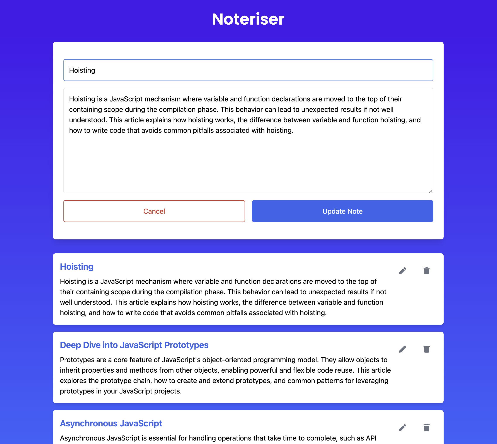

# Noteriser

Noteriser is a web application designed to manage notes. It allows users to create, read, update, and delete notes. The application is built using Node.js, Express, MongoDB, and a frontend powered by HTML, CSS, and JavaScript.

## Features

- **Create Note**: Add new notes with a title and content.
- **Read Notes**: View all existing notes.
- **Update Note**: Edit the title and content of existing notes.
- **Delete Note**: Remove notes that are no longer needed.

## Demo



## Prerequisites

- Docker

## Getting Started

### Clone the Repository

```sh
git clone https://github.com/yourusername/noteriser.git
cd noteriser
```

### Running the Application

1. **Build and Start the Containers**

   ```sh
   docker-compose up --build
   ```

2. **Access the Application**

   Open your web browser and navigate to `http://localhost:8080`.

## Project Structure

- **backend**: Contains the backend code (Node.js, Express, MongoDB).
  - [`app.js`](command:_github.copilot.openRelativePath?%5B%7B%22scheme%22%3A%22file%22%2C%22authority%22%3A%22%22%2C%22path%22%3A%22%2FUsers%2Fmuji%2Frepos%2Fnoteriser%2Fbackend%2Fapp.js%22%2C%22query%22%3A%22%22%2C%22fragment%22%3A%22%22%7D%5D "/Users/muji/repos/noteriser/backend/app.js"): Main application file.
  - [`routes/notes.js`](command:_github.copilot.openRelativePath?%5B%7B%22scheme%22%3A%22file%22%2C%22authority%22%3A%22%22%2C%22path%22%3A%22%2FUsers%2Fmuji%2Frepos%2Fnoteriser%2Fbackend%2Froutes%2Fnotes.js%22%2C%22query%22%3A%22%22%2C%22fragment%22%3A%22%22%7D%5D "/Users/muji/repos/noteriser/backend/routes/notes.js"): Routes for handling note operations.
  - [`models/Note.js`](command:_github.copilot.openSymbolFromReferences?%5B%22models%2FNote.js%22%2C%5B%7B%22uri%22%3A%7B%22%24mid%22%3A1%2C%22fsPath%22%3A%22%2FUsers%2Fmuji%2Frepos%2Fnoteriser%2Fbackend%2Froutes%2Fnotes.js%22%2C%22external%22%3A%22file%3A%2F%2F%2FUsers%2Fmuji%2Frepos%2Fnoteriser%2Fbackend%2Froutes%2Fnotes.js%22%2C%22path%22%3A%22%2FUsers%2Fmuji%2Frepos%2Fnoteriser%2Fbackend%2Froutes%2Fnotes.js%22%2C%22scheme%22%3A%22file%22%7D%2C%22pos%22%3A%7B%22line%22%3A2%2C%22character%22%3A25%7D%7D%2C%7B%22uri%22%3A%7B%22%24mid%22%3A1%2C%22fsPath%22%3A%22%2FUsers%2Fmuji%2Frepos%2Fnoteriser%2Fbackend%2Froutes%2Fnotes.js%22%2C%22external%22%3A%22file%3A%2F%2F%2FUsers%2Fmuji%2Frepos%2Fnoteriser%2Fbackend%2Froutes%2Fnotes.js%22%2C%22path%22%3A%22%2FUsers%2Fmuji%2Frepos%2Fnoteriser%2Fbackend%2Froutes%2Fnotes.js%22%2C%22scheme%22%3A%22file%22%7D%2C%22pos%22%3A%7B%22line%22%3A2%2C%22character%22%3A25%7D%7D%5D%5D "Go to definition"): Mongoose model for notes.
- **frontend**: Contains the frontend code (HTML, CSS, JavaScript).
  - [`index.html`](command:_github.copilot.openRelativePath?%5B%7B%22scheme%22%3A%22file%22%2C%22authority%22%3A%22%22%2C%22path%22%3A%22%2FUsers%2Fmuji%2Frepos%2Fnoteriser%2Ffrontend%2Findex.html%22%2C%22query%22%3A%22%22%2C%22fragment%22%3A%22%22%7D%5D "/Users/muji/repos/noteriser/frontend/index.html"): Main HTML file.
  - [`app.js`](command:_github.copilot.openRelativePath?%5B%7B%22scheme%22%3A%22file%22%2C%22authority%22%3A%22%22%2C%22path%22%3A%22%2FUsers%2Fmuji%2Frepos%2Fnoteriser%2Fbackend%2Fapp.js%22%2C%22query%22%3A%22%22%2C%22fragment%22%3A%22%22%7D%5D "/Users/muji/repos/noteriser/backend/app.js"): JavaScript file for frontend logic.

## API Endpoints

- **GET /api/notes**: Retrieve all notes.
- **POST /api/notes**: Create a new note.
- **PUT /api/notes/:id**: Update an existing note by ID.
- **DELETE /api/notes/:id**: Delete a note by ID.

## 

<p align="left">
  
  
  
  
  
  
  
  
  
  
  
</p>